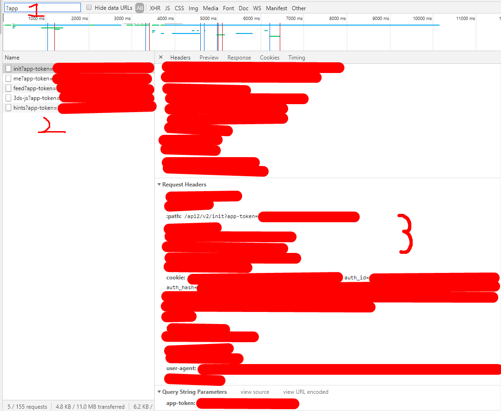
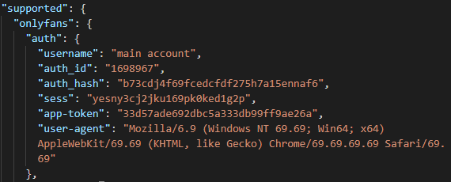

# OnlyFans DataScraper (Python 3.8.X)

=============

# Mandatory Tutorial
Read the [#FAQ](README.md#faq) at the bottom of this page before submitting a issue.

From the project folder open CMD/Terminal and run the command below:

`pip install -r requirements.txt`

Start:

`start_ofd.py`

Open and edit:

`config.json`

[auth]

Fill in the following:

* `{"auth_id":"your_auth_id"}`
* `{"sess":"your_sess_token"}`
* `{"user-agent":"your_user-agent"}`

If you're using 2FA or have this cookie:
* `{"auth_hash":"your_auth_hash"}`
* `{"auth_uniq_":"your_auth_uniq_"}`

Optional change:
* `{"fp":"your_fp"}`
* `{"app-token":"your_token"}`

Go to www.onlyfans.com and login, open the network debugger, then check the image below on how to get said above cookies

Your auth config should look similar to this

# USAGE

`python start_ofd.py`

Enter in inputs as prompted by console.

  
# OPTIONAL

Open:

`config.json` (Open with a texteditor)

[settings]

[#download_path](README#download_path):
    
    Default = "{site_name}"

    {site_name} = The site's name you're scraping
    Leave directory empty if you want files to be downloaded in the script folder.

    If you're going to fill, please remember to use forward ("/") slashes only.

[#file_name_format](README#file_name_format):

    Default = "{file_name}.{ext}"

    {post_id} = The posts's ID

    {media_id} = The media's ID [UNIQUE]
    
    {file_name} = The media's file name [UNIQUE]
    
    {username} = The account's username

    {date} = The post's creation date
    
    {text} = The media's text (You will get errors; don't use this)

    {ext} = The media's file extension

    Example: {date}/{text}-{file_name}.{ext}
    Warning: It's important to keep a unique identifier next to .{ext}. By default it's {file_name}.
    
[#text_length](README#text_length):

    Default = ""
    Ideal = "50"
    Max = "255"

    When you use {text} in file_name_format, a limit of how many characters can be set by inputting a number.
    
[#auto_site_choice](README.md#auto_site_choice):

    Default = ""

    When you start the script you will be presented with the following scraping choices:
    onlyfans = onlyfans
    justforfans = justforfans

    You can automatically choose what you want to scrape if you add it in the config file.
    
[#auto_choice](README.md#auto_choice):

    Default = ""

    When you start the script you will be presented with the following scraping choices:
    Everything = "a"
    Images = "b"
    Videos = "c"
    Audios = "d"

    You can automatically choose what you want to scrape if you add it in the config file.
    
[#auto_scrape_names](README.md#auto_scrape_names):

    Default = false

    If set to true, the script will scrape all the names.
    
[#auto_scrape_apis](README.md#auto_scrape_apis):

    Default = true

    If set to false, you'll be given the option to scrape individual apis.
    
[#export_type](README.md#export_type):

    Default = "json"

    a = "json"
    b = "csv"

    You can export an archive to different formats.

[#overwrite_files](README.md#overwrite_files):

    Default = true

    If set to false, any file with the same name won't be downloaded.

[#date_format](README.md#date_format):

    Default = "%d-%m-%Y"

    If you live in the USA and you want to use the incorrect format, use the following:

    "%m-%d-%Y"

[#multithreading](README.md#multithreading):

    Default = true

    If set to false, you will download files 1 by 1. (If you don't have fast internet, may god help you.)
    I'd reccomend leaving it set to true.

[#exit_on_completion](README.md#exit_on_completion):

    Default = false

    If set to true the scraper run once and exit upon completion, otherwise the scraper will give the option to run again. This is useful if the scraper is being executed by a cron job or another script.

[#infinite_loop](README.md#infinite_loop):

    Default = true

    If set to false, the script will run once and ask you to input anything to continue.

[#loop_timeout](README.md#loop_timeout):

    Default = 0

    When infinite_loop is set to true this will set the time in seconds to pause the loop in between runs. 

[#boards](README.md#boards):

    Default = []
    Example = ["s", "gif"]

    Input boards names that you want to automatically scrape.

[#ignored_keywords](README.md#ignored_keywords):

    Default = []
    Example = ["ignore", "me"]

    Any words you input, the script will ignore any content that contains these words.

[#ignore_type](README.md#ignore_type):

    Default = ""
    a = "paid"
    b = "free"

    This setting will not include any paid or free accounts in your subscription list.

    Example: "ignore_type": "paid"

    This choice will not include any accounts that you've paid for.

[#export_metadata](README.md#export_metadata):

    Default = true

    Set to false if you don't want to save metadata.

[#sort_free_paid_posts](README.md#sort_free_paid_posts):

    Default = true

    Set to false if you want to use the old file structure.
    If you do set to false, it'll be incompatable.

[#blacklist_name](README.md#blacklist_name):

    Default = ""

    This setting will not include any blacklisted usernames when you choose the "scrape all" option.

    Go to https://onlyfans.com/my/lists and create a new list; you can name it whatever you want but I called mine "Blacklisted".

    Add the list's name to the config.

    Example: "blacklist_name": "Blacklisted"

    You can create as many lists as you want.
    

[#OPTIONAL ARGUMENTS](README.md#OPTIONAL_ARGUMENTS)

-m

    The script will download metadata files only.

# FAQ
Before troubleshooting, make sure you're using Python 3.8.

Error: Access Denied /  Auth Loop

>Make sure your cookies and user-agent are correct.

AttributeError: type object 'datetime.datetime' has no attribute 'fromisoformat'

>Only works with Python 3.7 and above.

I can't see ".settings" folder'

>Make sure you can see hidden files
>
>[Windows Tutorial](https://support.microsoft.com/en-gb/help/4028316/windows-view-hidden-files-and-folders-in-windows-10)
>
>[Mac Tutorial](https://setapp.com/how-to/show-hidden-files-on-mac)
>
>[Linux](https://www.google.com/)

I'm getting authed into the wrong account

>Enjoy the free content.

I'm using Linux OS and something isn't working.

>Script was built on Windows 10. If you're using Linux you can still submit an issue and I'll try my best to fix it.
    
Do OnlyFans or OnlyFans models know I'm using this script?

>No, but there is identifiable information in the metadata folder which contains your IP address, so don't share it unless you're using a proxy/vpn or just don't care.
    
Do you collect session information?

>No. The code is on Github which allows you to audit the codebase yourself. You can use wireshark or any other network analysis program to verify the outgoing connections are respective to the modules you chose.
